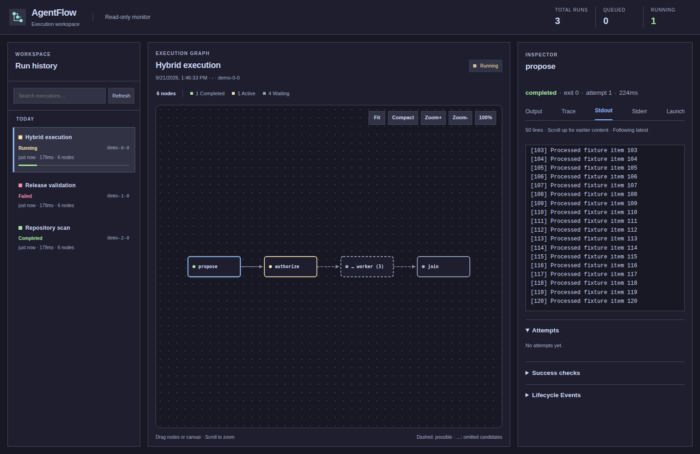

# Hybrid orchestration

AgentFlow keeps business roles, authorization policies, and capacity decisions in
the application. An optional activation gate connects deterministic code with
Agent-generated suggestions without evaluating a model response as code.

## Decision contract

Set a candidate node's `activation` to an object containing `source` (a node ID)
and `path` (JSON object keys, defaulting to the document root). The source is
added as a dependency. Its final captured output must be JSON; the selected value
must be a boolean or a non-negative integer.

A boolean enables or skips the candidate. For a fanout, an integer enables the
first N members in declaration order. Capacity comes from the application's
existing fanout declaration; a count exceeding it fails before candidate
execution. Non-integers, negative counts, missing keys, malformed JSON, and
activation dependency cycles are rejected. `node_activation` events record the
source, path, decision, and selected state. Unselected candidates are skipped
without launching processes or creating their artifact directories.

These are declared candidate definitions whose execution is deferred. They are
not arbitrary new node specifications accepted from an Agent. A later stage can
have its own gate and capacity to enable additional work. Each stage uses the
same optional primitive; no mandatory controller roles or global workflow
budgets are installed by the framework.

Downstream nodes default to `trigger_rule="all_success"`. An optional
`trigger_rule="all_done"` waits for every dependency to become terminal, including
skipped or failed candidates. Use it for a join that must inspect all outcomes;
it does not turn failed work into successful work.

## Non-Agent execution

- `python_node(task_id=..., code=...)` runs application-owned Python code.
- `python_call(task_id=..., function="package.module:function", arguments={...})`
  imports and calls a function inside the execution target, then captures its
  JSON return value. Function stdout is redirected to stderr so diagnostics do
  not corrupt that result. The function and its dependencies must be installed or
  importable there. Arguments are data, not Python source.
- `command(task_id=..., argv=[...])` invokes an external program with explicit
  arguments. It does not insert a shell; explicitly configured target shell
  wrappers still apply. This supports service clients, scripts, and other
  non-Agent tools without requiring a model or an MCP server.
- `AdapterRegistry.register(name, adapter)` remains available for custom
  execution preparation. The target runner owns process execution, timeouts,
  cancellation, and artifacts.

Normal target isolation, dependency scheduling, and retry settings apply to
these nodes. Code with external effects should be idempotent before retries are
enabled. Dynamic template data must be JSON-encoded before insertion into code
or argument documents; the example uses the `tojson` filter.

## Recommended composition

An Agent may propose whether more work is useful. A code gate validates that
proposal against application permissions and capacity, then emits the activation
value. The runtime enforces the declared dependencies and launches only selected
work. Inspect the optional [example](../examples/hybrid_orchestration.py): running
that file prints a pipeline; it does not invoke an Agent. Its capacity of three
is an example policy, not a framework limit.

This separation is consistent with conditional routing and per-item execution in
[AWS Step Functions Choice](https://docs.aws.amazon.com/step-functions/latest/dg/state-choice.html)
and [Map](https://docs.aws.amazon.com/step-functions/latest/dg/state-map-distributed.html),
and with the separation of deterministic workflow decisions from effectful
activities in [Temporal's architecture](https://github.com/temporalio/temporal/blob/main/docs/architecture/README.md).
These are design precedents, not performance or reliability equivalence claims.
AgentFlow records decisions but does not claim Temporal-style durable replay.

## Monitor notation

The monitor remains read-only. Dashed edges identify unresolved candidate
activation. Resolved dependency and restart edges are solid; a restart is not a
possible-creation edge. `…` represents omitted candidate definitions and shows
their count; click the preview to expand, or use Compact to restore folding.
Python and external-command nodes participate in the same graph and inspector.

The current interpretation of feedback length counts nodes in the feedback path:
a self-loop or two-node feedback path stays explicit. Candidate definitions in
paths of three or more nodes, and candidates outside feedback paths, can be
folded. Already running or terminal nodes remain visible. This is a projection
of the graph, not a mutation of its dependency or restart semantics.

The preview uses mocked data; the candidate box is a display projection of three
declared worker definitions awaiting an activation decision.
