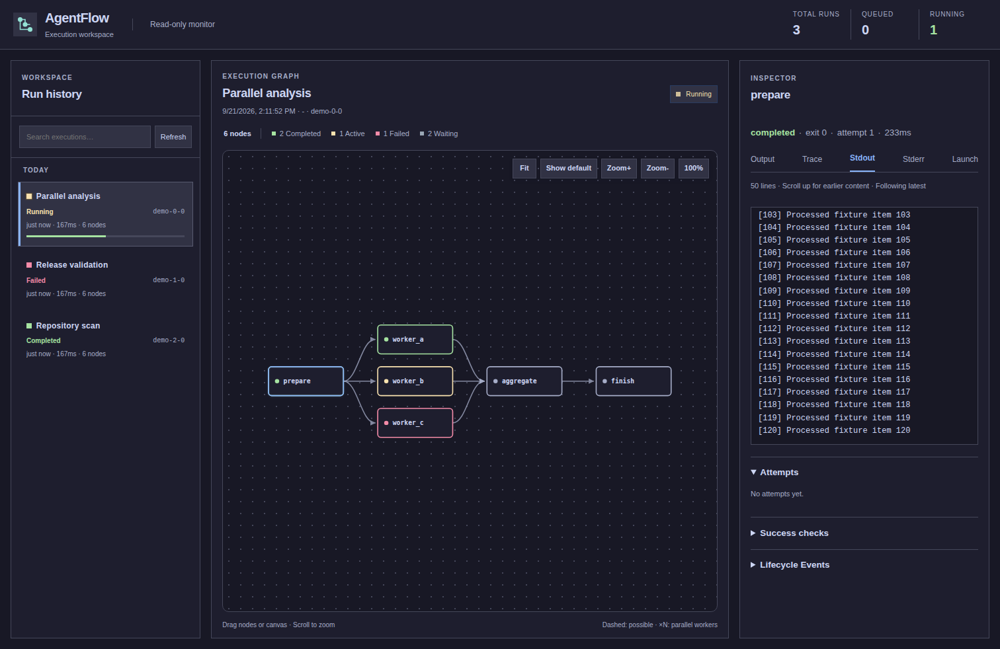
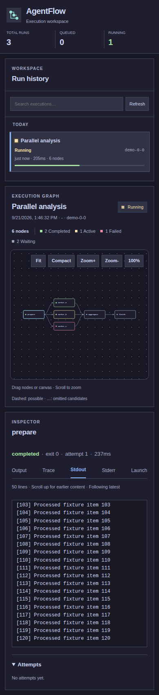

# Core monitor previews

AgentFlow core monitor with the fixed [Catppuccin Mocha palette](https://catppuccin.com/palette/).
These screenshots were captured on 2026-09-21 using mocked run and artifact
data. They illustrate the earlier interface, not a live execution or benchmark
result; their Show default control predates the current Show full toggle.

The monitor uses one fixed theme, with square corners outside the main graph.
It supports draggable nodes, canvas panning and zooming, dependency arrows,
and a tabbed node inspector. By default, reached nodes and downstream possibilities appear, with one
representative per unreached parallel worker group. **Show full** includes skipped
and cancelled branches, disconnected nodes, every worker, and individual dependency
arrows. Directed
return arcs show cycles. History progress counts settled stages against the
longest acyclic dependency path, independent of worker count or retry count.
See [Hybrid orchestration](hybrid-orchestration.md#monitor-notation) for the exact
display and progress rules.

## Read-only behavior and live logs

The monitor service only allows GET and HEAD. It exposes no pipeline creation,
validation, cancellation, or rerun endpoints. Search, tabs, graph dragging, and
zooming only change the local view. Runs are managed through CLI or Python APIs.

Stdout and Stderr initially display the latest 50 lines. Trace displays the latest
50 normalized JSONL records, including their provider, kind, title, and content.
Scroll upward to prepend earlier windows; the viewport preserves its position.
At the bottom, the visible log refreshes every 1.5 seconds. While reading history,
new content does not move the viewport; scroll back to the bottom to follow it.
Each log page contains at most 64 KiB of source content, in addition to the line
limit. Oversized lines or trace records appear in labelled parts; scroll upward
to retrieve earlier parts. Partial trace records display as raw text. UTF-8
characters and CRLF pairs stay intact across pages. Reads run in the server's
worker thread pool.

The tail API returns `partial_start` and `partial_end` flags for fragments at the
page boundaries. Its `before` and `end` cursors delimit source bytes; requesting
`before` retrieves preceding content without skipping the rest of a long record.
The byte limit applies to source content, so JSON escaping can increase the wire
size. File byte cursors keep historical pages stable while producers append output.
Raw stdout and stderr remain available for inspection; terminal color escapes
are stripped only in the display and HTML is rendered as text.

Output compatibility is checked with representative mocked records for all
14 built-in agent kinds plus a custom provider, including attempt initialization
and retry resets, and the existing parser suite. The ZCode attempt initializer
was corrected to avoid a slotted-dataclass `super()` failure.
Codex, Claude, Kimi, Pi, OpenCode/Kilo, Goose, DeepSeek, and ZCode use specialized
parsers; remaining kinds retain generic text output. These checks validate the
implemented formats, not every version of real third-party CLI software.

## Desktop

Viewport: 1512 × 982 pixels.

## Mobile

Viewport: 390 × 844 pixels; the image captures the full page.

## Validation

The interface is covered by mocked browser tests in
[`tests/e2e/monitor.spec.js`](../tests/e2e/monitor.spec.js), including responsive
layouts, the fixed palette and corner styling, node dragging, arrow direction, canvas panning,
and touch interaction. See [Testing and maintainer workflows](testing.md) for
the browser test setup.
