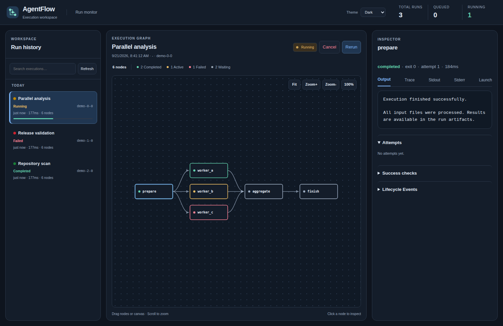
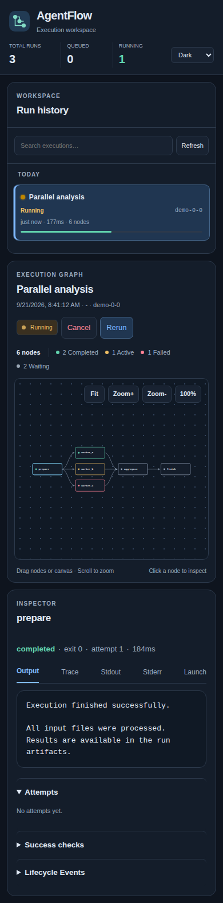

# Core monitor previews

AgentFlow core monitor with the dark theme selected. These screenshots were
captured on 2026-09-21 from revision `1c6d44f`, using mocked run and artifact
data. They illustrate the interface, not a live execution or benchmark result.

The monitor supports system, light, and dark themes; draggable nodes; canvas
panning and zooming; dependency arrows; and a tabbed node inspector.

## Desktop

Viewport: 1512 × 982 pixels.

## Mobile

Viewport: 390 × 844 pixels; the image captures the full page.

## Validation

The interface is covered by mocked browser tests in
[`tests/e2e/monitor.spec.js`](../tests/e2e/monitor.spec.js), including responsive
layouts, theme persistence, node dragging, arrow direction, canvas panning,
and touch interaction. See [Testing and maintainer workflows](testing.md) for
the browser test setup.
